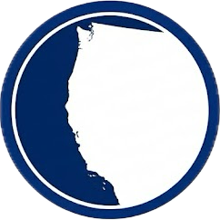
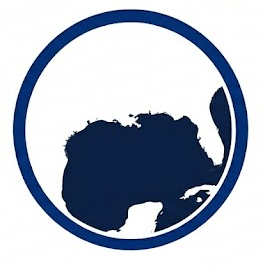
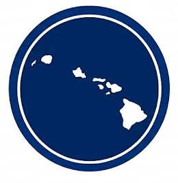
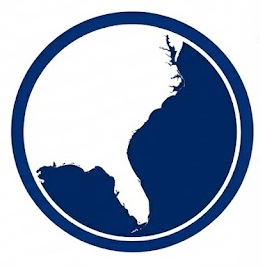

```{=html}
<div class="hero-wrapper">
<div class="hero-banner">
<h1 style="color: white !important;">EcoCast Plus</h1>
<h3 style="color: white !important;">Operational Dynamic Ocean Management</h3>
<p class="lead" style="color: white !important;">Delivering real-time species distribution models to support sustainable fisheries and protected species conservation across U.S. waters.</p>
</div>
</div>

<div class="column-page">
<br><br>

<div class="text-center" style="margin-bottom: 3rem;">
<h2 style="color: #003087; font-weight: 800;">Regional Toolkits</h2>
<p class="text-muted" style="font-size: 1.2rem;">Select a region to access operational models.</p>
</div>

<div class="icon-grid">

<a href="west_coast/leatherback.html" class="icon-link">
<div class="icon-item">
<div class="icon-circle">

</div>
<div class="icon-title">West Coast</div>
<div class="icon-text">Leatherback & Swordfish Tools</div>
</div>
</a>

<a href="gulf/pelagic_longline.html" class="icon-link">
<div class="icon-item">
<div class="icon-circle">

</div>
<div class="icon-title">Gulf of America</div>
<div class="icon-text">Pelagic Longline Optimization</div>
</div>
</a>

<div class="icon-item disabled-item">
<div class="icon-circle disabled-circle">

</div>
<div class="icon-title">Hawaii</div>
<div class="icon-text">Coming Soon</div>
</div>

<div class="icon-item disabled-item">
<div class="icon-circle disabled-circle">

</div>
<div class="icon-title">South Atlantic</div>
<div class="icon-text">Coming Soon</div>
</div>

</div>

<hr style="max-width: 80%; margin: 4rem auto; border-top: 2px solid #eee;">

<div class="grid" style="max-width: 1000px; margin: 0 auto; display: grid; grid-template-columns: 1fr 1fr; gap: 2rem;">

<div>
<h4 style="color: #003087; font-weight: bold;">About the Initiative</h4>
<p style="color: #444;">EcoCast Plus integrates real-time oceanographic data from Copernicus Marine Service (CMEMS) and ROMS models to generate daily predictive surfaces. Our goal is to maximize fishing opportunity while minimizing bycatch interactions.</p>
</div>

<div>
<h4 style="color: #003087; font-weight: bold;">System Status</h4>
<div style="background-color: #f8f9fa; padding: 1.5rem; border-left: 5px solid #28a745; border-radius: 4px;">
<ul style="list-style-type: none; padding-left: 0; margin-bottom: 0;">
<li style="margin-bottom: 0.5rem;"><i class="bi bi-check-circle-fill" style="color: #28a745;"></i> <strong>Data Feeds:</strong> Active (CMEMS/ROMS)</li>
<li style="margin-bottom: 0.5rem;"><i class="bi bi-check-circle-fill" style="color: #28a745;"></i> <strong>Models:</strong> Operational</li>
</ul>
</div>

<div style="margin-top: 1.5rem; color: #444;">
<strong>Technical Support:</strong><br>
<ul style="list-style-type: none; padding-left: 0; margin-top: 0.5rem;">
<li style="margin-bottom: 0.3rem;">
<a href="mailto:sarah.roberts@noaa.gov" style="text-decoration: none; color: #005da2;">
<i class="bi bi-envelope"></i> Sarah Roberts (NOAA)
</a>
</li>
<li>
<a href="mailto:jacullen@ucsc.edu" style="text-decoration: none; color: #005da2;">
<i class="bi bi-envelope"></i> Josh Cullen (UCSC)
</a>
</li>
</ul>
</div>

</div>

</div>

<br><br><br>

</div>
